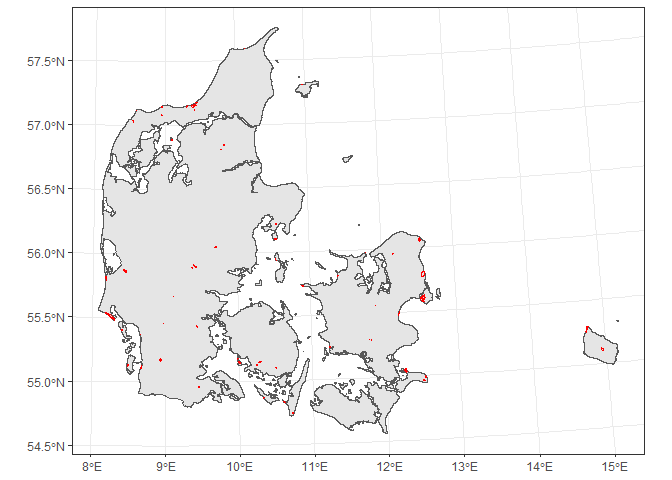

README
================

## Objective

The objective of this repository is to check which points in the NOVANA
dataset are within the Polygons in
(Fencelines\_mardb\_restricted\_use/Copy\_forpagt\_reduced/copy\_forpagt\_reduced.shp),
and how many years they have been sampled.

## Methods

### Packages needed

First load the needed packages

``` r
library(sf) # For shapefile manipulation
library(tidyverse) # to wranggle data
library(raster) # To get a map of Denmark
```

### Load the needed datasets

``` r
## Generate a polygon of Denmar
Denmark <- getData(name = "GADM", country = "DNK", level = 0) %>% 
  #transform to SF
  st_as_sf() %>% 
  # Transform to UTM
  st_transform(crs = "+proj=utm +zone=32 +ellps=GRS80 +units=m +no_defs")

## Read the polygons
Polygons <- read_sf("O:/Nat_Ecoinformatics/C_Write/_Proj/Monitoring_management_AU135847/Fencelines_mardb_restricted_use/Copy_forpagt_reduced/copy_forpagt_reduced.shp") %>% 
  # Transform to UTM
  st_transform(crs = "+proj=utm +zone=32 +ellps=GRS80 +units=m +no_defs")


#Read csv for NOVANA sites with MV text as NA
ForSelection <- data.table::fread(file= "alledata-abiotiske.csv", na.strings = "mv") %>% 
  # Transform to dataframe
  as.data.frame()  %>%
  ## Get an ID per ste ¨plot
  unite(col = "ID", site, plot)  %>% 
  #SElect only desired columns
  dplyr::select(ID, year, UTMx, UTMy) %>% 
  ## Eliminate sites with no coordintates
  dplyr::filter(!is.na(UTMx), !is.na(UTMy)) %>% 
  ## Make it spatial
  st_as_sf(coords = c("UTMx", "UTMy"),crs = "+proj=utm +zone=32 +ellps=GRS80 +units=m +no_defs") %>% 
  ## Get only the ones that intersect with the polygons
  st_intersection(Polygons) %>% 
  ## Select just a few columns
  dplyr::select(year, OBJECTID) %>% 
  ## Now only get one per site per year
  dplyr::distinct()
```

There are 11977 samples from 242

## See the number of polygons that have been sampled at least in 4 different years

``` r
ForSelectionDF <- ForSelection %>% 
  ## Transform to data.frame 
  as.data.frame() %>% 
## Select again the variables to take out the spatial component
  dplyr::select(year, OBJECTID) %>% 
  ## just get unique values
  dplyr::distinct() %>% 
  #Now just group by OBJECTID to get the number of years a site has been sampled
  group_by(OBJECTID) %>% 
  summarise(n_years = n(), first_year = min(year), last_year = max(year)) %>% 
  ## order by number of years
  arrange(desc(n_years))
```

This are the first 20 observations from that dataframe:

| OBJECTID | n\_years | first\_year | last\_year |
|---------:|---------:|------------:|-----------:|
|     4261 |        9 |        2004 |       2014 |
|     4328 |        9 |        2004 |       2014 |
|     4362 |        9 |        2004 |       2014 |
|     4373 |        9 |        2004 |       2014 |
|     4375 |        9 |        2004 |       2014 |
|     4525 |        9 |        2004 |       2014 |
|     4630 |        9 |        2004 |       2014 |
|     4767 |        9 |        2004 |       2014 |
|     4840 |        9 |        2004 |       2014 |
|     5188 |        9 |        2004 |       2014 |
|     5199 |        9 |        2004 |       2014 |
|     5271 |        9 |        2004 |       2014 |
|     5276 |        9 |        2004 |       2014 |
|     5463 |        9 |        2004 |       2014 |
|     5552 |        9 |        2004 |       2014 |
|     5558 |        9 |        2004 |       2014 |
|     5719 |        9 |        2004 |       2014 |
|     5953 |        9 |        2004 |       2014 |
|    24320 |        9 |        2004 |       2014 |
|     4064 |        8 |        2004 |       2014 |

And now filter to the sites that have at least 4 years with
observations:

``` r
Selected <- ForSelectionDF %>% 
  dplyr::filter(n_years >= 4)
```

This are 76 sites

Get the selected polygons

``` r
polygons_selected <- Polygons %>% 
  right_join(Selected)
```

This is where they are

<!-- -->

Now transform back to the prior projection

``` r
polygons_selected <- polygons_selected %>% 
  st_transform(crs = "+proj=longlat +datum=WGS84 +no_defs") 
```

And write to an sf

``` r
write_sf(polygons_selected, "Selected.shp")
```
